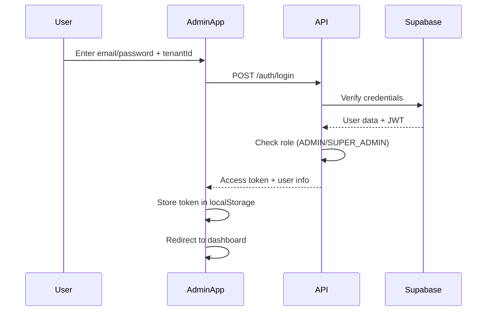

# FitStack Admin Dashboard - Part 1: Architecture & Design

## 📋 Table of Contents
1. [Overview](#overview)
2. [Tech Stack](#tech-stack)
3. [Authentication Flow](#authentication-flow)
4. [Project Structure](#project-structure)
5. [API Integration](#api-integration)
6. [State Management](#state-management)
7. [Routing & Navigation](#routing--navigation)
8. [UI/UX Design System](#uiux-design-system)

---

## 🎯 Overview

The FitStack Admin Dashboard is a **React-based Progressive Web App (PWA)** designed exclusively for administrators to manage all aspects of their fitness facility. This dashboard provides a centralized interface for managing classes, sessions, trainers, marketplace products, community events, and more.

### Key Features
- 🔐 **Admin-Only Access** - Restricted to ADMIN and SUPER_ADMIN roles
- 📱 **Progressive Web App** - Installable, offline-capable, mobile-responsive
- 🎨 **Modern UI** - Clean, intuitive interface with Material Design principles
- 🚀 **Real-time Updates** - Live data synchronization
- 📊 **Analytics Dashboard** - Key metrics and insights
- 🔔 **Notification Management** - Push notification controls

### User Roles Supported
- **ADMIN** - Full access to their tenant's data
- **SUPER_ADMIN** - Cross-tenant access (floater admin)

---

## 🛠️ Tech Stack

### Core Technologies
```json
{
  "framework": "React 18.x",
  "language": "TypeScript 5.x",
  "buildTool": "Vite 5.x",
  "styling": "Tailwind CSS 3.x + shadcn/ui",
  "stateManagement": "Zustand 4.x",
  "routing": "React Router v6",
  "httpClient": "Axios 1.x",
  "formHandling": "React Hook Form + Zod",
  "dataVisualization": "Recharts",
  "dateHandling": "date-fns",
  "pwa": "Vite PWA Plugin"
}
```

### UI Component Library
**shadcn/ui** - Accessible, customizable components built on Radix UI
- Button, Input, Select, Dialog, Dropdown, Table, Card, Badge, Toast
- Form components with validation
- Data tables with sorting, filtering, pagination
- Command palette for quick actions

### Why This Stack?

1. **Vite** - Lightning-fast development, optimized builds, PWA support
2. **TypeScript** - Type safety, better IDE support, fewer runtime errors
3. **Tailwind CSS** - Rapid UI development, consistent design system
4. **Zustand** - Lightweight state management (simpler than Redux)
5. **React Hook Form** - Performant forms with minimal re-renders
6. **shadcn/ui** - Copy-paste components, full customization control

---

## 🔐 Authentication Flow

### Login Process



### API Endpoints Used

#### 1. Regular Admin Login
```typescript
POST /api/v1/auth/login
Content-Type: application/json

{
  "email": "admin@gymdowntown.com",
  "password": "SecurePass123!",
  "tenantId": "gymdowntown_abc123"
}

Response:
{
  "access_token": "eyJhbGci...",
  "refresh_token": "eyJhbGci...",
  "expires_in": 3600,
  "expires_at": 1702123456,
  "user": {
    "id": "uuid",
    "email": "admin@gymdowntown.com",
    "firstName": "John",
    "lastName": "Doe",
    "role": "admin",
    "tenantId": "gymdowntown_abc123"
  }
}
```

#### 2. Super Admin Login (Floater)
```typescript
POST /api/v1/auth/super-admin/login
Content-Type: application/json

{
  "email": "superadmin@fitstack.com",
  "password": "SuperSecure123!"
}

Response:
{
  "access_token": "eyJhbGci...",
  "user": {
    "role": "super_admin",
    "aal": "aal1"
  },
  "message": "Super admin login successful. You have unrestricted access to all tenants."
}
```

### Authentication Implementation

```typescript
// src/services/auth.service.ts
import axios from 'axios';

const API_BASE_URL = import.meta.env.VITE_API_BASE_URL;

export interface LoginCredentials {
  email: string;
  password: string;
  tenantId?: string; // Optional for super admin
}

export interface AuthResponse {
  access_token: string;
  refresh_token?: string;
  expires_in: number;
  expires_at: number;
  user: {
    id: string;
    email: string;
    firstName?: string;
    lastName?: string;
    role: 'admin' | 'super_admin';
    tenantId?: string;
  };
}

class AuthService {
  async login(credentials: LoginCredentials): Promise<AuthResponse> {
    const endpoint = credentials.tenantId 
      ? '/auth/login' 
      : '/auth/super-admin/login';
    
    const { data } = await axios.post<AuthResponse>(
      `${API_BASE_URL}${endpoint}`,
      credentials
    );

    // Store tokens
    localStorage.setItem('access_token', data.access_token);
    if (data.refresh_token) {
      localStorage.setItem('refresh_token', data.refresh_token);
    }
    localStorage.setItem('user', JSON.stringify(data.user));

    return data;
  }

  async logout(): Promise<void> {
    localStorage.removeItem('access_token');
    localStorage.removeItem('refresh_token');
    localStorage.removeItem('user');
  }

  getAccessToken(): string | null {
    return localStorage.getItem('access_token');
  }

  getUser(): AuthResponse['user'] | null {
    const user = localStorage.getItem('user');
    return user ? JSON.parse(user) : null;
  }

  isAuthenticated(): boolean {
    return !!this.getAccessToken();
  }

  isAdmin(): boolean {
    const user = this.getUser();
    return user?.role === 'admin' || user?.role === 'super_admin';
  }

  isSuperAdmin(): boolean {
    const user = this.getUser();
    return user?.role === 'super_admin';
  }
}

export const authService = new AuthService();
```

### Axios Interceptor Setup

```typescript
// src/lib/axios.ts
import axios from 'axios';
import { authService } from '@/services/auth.service';

const api = axios.create({
  baseURL: import.meta.env.VITE_API_BASE_URL,
  headers: {
    'Content-Type': 'application/json',
  },
});

// Request interceptor - Add auth token
api.interceptors.request.use(
  (config) => {
    const token = authService.getAccessToken();
    if (token) {
      config.headers.Authorization = `Bearer ${token}`;
    }
    return config;
  },
  (error) => Promise.reject(error)
);

// Response interceptor - Handle 401 errors
api.interceptors.response.use(
  (response) => response,
  async (error) => {
    if (error.response?.status === 401) {
      // Token expired or invalid
      authService.logout();
      window.location.href = '/login';
    }
    return Promise.reject(error);
  }
);

export default api;
```

### Protected Route Component

```typescript
// src/components/ProtectedRoute.tsx
import { Navigate, Outlet } from 'react-router-dom';
import { authService } from '@/services/auth.service';

export const ProtectedRoute = () => {
  if (!authService.isAuthenticated()) {
    return <Navigate to="/login" replace />;
  }

  if (!authService.isAdmin()) {
    return (
      <div className="flex h-screen items-center justify-center">
        <div className="text-center">
          <h1 className="text-2xl font-bold text-red-600">Access Denied</h1>
          <p className="mt-2 text-gray-600">This dashboard is for administrators only.</p>
        </div>
      </div>
    );
  }

  return <Outlet />;
};
```

---

## 📁 Project Structure

```
fitstack-admin/
├── public/
│   ├── icons/                    # PWA icons (192x192, 512x512)
│   ├── manifest.json             # PWA manifest
│   └── robots.txt
├── src/
│   ├── assets/                   # Images, fonts, static files
│   ├── components/               # Reusable UI components
│   │   ├── ui/                   # shadcn/ui components
│   │   │   ├── button.tsx
│   │   │   ├── input.tsx
│   │   │   ├── dialog.tsx
│   │   │   ├── table.tsx
│   │   │   └── ...
│   │   ├── layout/               # Layout components
│   │   │   ├── Sidebar.tsx
│   │   │   ├── Header.tsx
│   │   │   ├── Footer.tsx
│   │   │   └── DashboardLayout.tsx
│   │   ├── forms/                # Form components
│   │   │   ├── ClassForm.tsx
│   │   │   ├── SessionForm.tsx
│   │   │   ├── TrainerForm.tsx
│   │   │   └── ProductForm.tsx
│   │   ├── tables/               # Data table components
│   │   │   ├── ClassesTable.tsx
│   │   │   ├── SessionsTable.tsx
│   │   │   ├── TrainersTable.tsx
│   │   │   └── ProductsTable.tsx
│   │   ├── charts/               # Chart components
│   │   │   ├── RevenueChart.tsx
│   │   │   ├── EnrollmentChart.tsx
│   │   │   └── ActivityChart.tsx
│   │   └── common/               # Common components
│   │       ├── LoadingSpinner.tsx
│   │       ├── ErrorBoundary.tsx
│   │       ├── ConfirmDialog.tsx
│   │       └── ImageUpload.tsx
│   ├── pages/                    # Page components
│   │   ├── auth/
│   │   │   ├── LoginPage.tsx
│   │   │   └── ForgotPasswordPage.tsx
│   │   ├── dashboard/
│   │   │   └── DashboardPage.tsx
│   │   ├── classes/
│   │   │   ├── ClassesListPage.tsx
│   │   │   ├── ClassCreatePage.tsx
│   │   │   ├── ClassEditPage.tsx
│   │   │   └── ClassDetailsPage.tsx
│   │   ├── sessions/
│   │   │   ├── SessionsListPage.tsx
│   │   │   ├── SessionCreatePage.tsx
│   │   │   ├── SessionEditPage.tsx
│   │   │   └── SessionDetailsPage.tsx
│   │   ├── trainers/
│   │   │   ├── TrainersListPage.tsx
│   │   │   ├── TrainerCreatePage.tsx
│   │   │   ├── TrainerEditPage.tsx
│   │   │   └── TrainerDetailsPage.tsx
│   │   ├── marketplace/
│   │   │   ├── ProductsListPage.tsx
│   │   │   ├── ProductCreatePage.tsx
│   │   │   ├── ProductEditPage.tsx
│   │   │   ├── ProductDetailsPage.tsx
│   │   │   └── EnquiriesListPage.tsx
│   │   ├── events/
│   │   │   ├── EventsListPage.tsx
│   │   │   ├── EventCreatePage.tsx
│   │   │   └── EventDetailsPage.tsx
│   │   ├── announcements/
│   │   │   ├── AnnouncementsListPage.tsx
│   │   │   └── AnnouncementCreatePage.tsx
│   │   ├── members/
│   │   │   ├── MembersListPage.tsx
│   │   │   └── MemberDetailsPage.tsx
│   │   └── settings/
│   │       ├── ProfilePage.tsx
│   │       ├── TenantSettingsPage.tsx
│   │       └── NotificationSettingsPage.tsx
│   ├── services/                 # API services
│   │   ├── auth.service.ts
│   │   ├── classes.service.ts
│   │   ├── sessions.service.ts
│   │   ├── trainers.service.ts
│   │   ├── marketplace.service.ts
│   │   ├── events.service.ts
│   │   ├── announcements.service.ts
│   │   ├── members.service.ts
│   │   └── analytics.service.ts
│   ├── stores/                   # Zustand stores
│   │   ├── authStore.ts
│   │   ├── classesStore.ts
│   │   ├── sessionsStore.ts
│   │   ├── trainersStore.ts
│   │   ├── marketplaceStore.ts
│   │   └── uiStore.ts
│   ├── hooks/                    # Custom React hooks
│   │   ├── useAuth.ts
│   │   ├── useClasses.ts
│   │   ├── useSessions.ts
│   │   ├── useTrainers.ts
│   │   ├── useMarketplace.ts
│   │   └── useToast.ts
│   ├── lib/                      # Utilities
│   │   ├── axios.ts              # Axios instance with interceptors
│   │   ├── utils.ts              # Helper functions
│   │   ├── constants.ts          # App constants
│   │   └── validators.ts         # Validation schemas
│   ├── types/                    # TypeScript types
│   │   ├── auth.types.ts
│   │   ├── class.types.ts
│   │   ├── session.types.ts
│   │   ├── trainer.types.ts
│   │   ├── marketplace.types.ts
│   │   └── common.types.ts
│   ├── App.tsx                   # Root component
│   ├── main.tsx                  # Entry point
│   ├── router.tsx                # Route configuration
│   └── index.css                 # Global styles
├── .env.example                  # Environment variables template
├── .env.local                    # Local environment variables
├── .gitignore
├── index.html
├── package.json
├── tsconfig.json
├── tailwind.config.js
├── vite.config.ts
└── README.md
```

---

## 🔌 API Integration

### Base API Configuration

```typescript
// src/lib/constants.ts
export const API_CONFIG = {
  BASE_URL: import.meta.env.VITE_API_BASE_URL || 'http://localhost:3000/api/v1',
  TIMEOUT: 30000, // 30 seconds
  RETRY_ATTEMPTS: 3,
};

export const API_ENDPOINTS = {
  // Auth
  LOGIN: '/auth/login',
  SUPER_ADMIN_LOGIN: '/auth/super-admin/login',
  LOGOUT: '/auth/logout',
  
  // Classes
  CLASSES: (tenantId: string) => `/tenants/${tenantId}/classes`,
  CLASS_DETAIL: (tenantId: string, classId: string) => `/tenants/${tenantId}/classes/${classId}`,
  CLASS_PUBLISH: (tenantId: string, classId: string) => `/tenants/${tenantId}/classes/${classId}/publish`,
  CLASS_ENROLLMENTS: (tenantId: string, classId: string) => `/tenants/${tenantId}/classes/${classId}/enrollments`,
  
  // Sessions
  SESSIONS: (tenantId: string) => `/tenants/${tenantId}/sessions`,
  SESSION_DETAIL: (tenantId: string, sessionId: string) => `/tenants/${tenantId}/sessions/${sessionId}`,
  SESSION_PAUSE: (tenantId: string, sessionId: string) => `/tenants/${tenantId}/sessions/${sessionId}/pause`,
  SESSION_RESUME: (tenantId: string, sessionId: string) => `/tenants/${tenantId}/sessions/${sessionId}/resume`,
  
  // Trainers
  TRAINERS: (tenantId: string) => `/tenants/${tenantId}/trainers`,
  TRAINER_DETAIL: (tenantId: string, trainerId: string) => `/tenants/${tenantId}/trainers/${trainerId}`,
  TRAINER_BOOKINGS: (tenantId: string, trainerId: string) => `/tenants/${tenantId}/trainers/${trainerId}/bookings`,
  
  // Marketplace
  PRODUCTS: (tenantId: string) => `/tenants/${tenantId}/marketplace/products`,
  PRODUCT_DETAIL: (tenantId: string, productId: string) => `/tenants/${tenantId}/marketplace/products/${productId}`,
  ENQUIRIES: (tenantId: string) => `/tenants/${tenantId}/marketplace/enquiries`,
  ENQUIRY_DETAIL: (tenantId: string, enquiryId: string) => `/tenants/${tenantId}/marketplace/enquiries/${enquiryId}`,
  
  // Community Events
  EVENTS: (tenantId: string) => `/tenants/${tenantId}/community-events`,
  EVENT_DETAIL: (tenantId: string, eventId: string) => `/tenants/${tenantId}/community-events/${eventId}`,
  EVENT_APPROVE: (tenantId: string, eventId: string) => `/tenants/${tenantId}/community-events/${eventId}/approve`,
  
  // Members
  MEMBERS: (tenantId: string) => `/tenants/${tenantId}/users`,
  MEMBER_DETAIL: (tenantId: string, userId: string) => `/tenants/${tenantId}/users/${userId}`,
  
  // Notifications
  NOTIFICATIONS: (tenantId: string) => `/tenants/${tenantId}/notifications`,
  SEND_NOTIFICATION: (tenantId: string) => `/tenants/${tenantId}/notifications/send`,
  
  // Feed
  FEED: (tenantId: string) => `/tenants/${tenantId}/feed`,
  
  // Schedule
  SCHEDULE: (tenantId: string) => `/tenants/${tenantId}/schedule`,
};
```

### Service Layer Pattern

Each entity has a dedicated service file that handles all API calls:

```typescript
// src/services/classes.service.ts
import api from '@/lib/axios';
import { API_ENDPOINTS } from '@/lib/constants';
import type { Class, CreateClassDto, UpdateClassDto, ClassQueryParams } from '@/types/class.types';

class ClassesService {
  async getAll(tenantId: string, params?: ClassQueryParams): Promise<Class[]> {
    const { data } = await api.get(API_ENDPOINTS.CLASSES(tenantId), { params });
    return data;
  }

  async getById(tenantId: string, classId: string): Promise<Class> {
    const { data } = await api.get(API_ENDPOINTS.CLASS_DETAIL(tenantId, classId));
    return data;
  }

  async create(tenantId: string, dto: CreateClassDto): Promise<Class> {
    const { data } = await api.post(API_ENDPOINTS.CLASSES(tenantId), dto);
    return data;
  }

  async update(tenantId: string, classId: string, dto: UpdateClassDto): Promise<Class> {
    const { data } = await api.patch(API_ENDPOINTS.CLASS_DETAIL(tenantId, classId), dto);
    return data;
  }

  async delete(tenantId: string, classId: string): Promise<void> {
    await api.delete(API_ENDPOINTS.CLASS_DETAIL(tenantId, classId));
  }

  async publish(tenantId: string, classId: string): Promise<Class> {
    const { data } = await api.post(API_ENDPOINTS.CLASS_PUBLISH(tenantId, classId));
    return data;
  }

  async getEnrollments(tenantId: string, classId: string): Promise<any[]> {
    const { data } = await api.get(API_ENDPOINTS.CLASS_ENROLLMENTS(tenantId, classId));
    return data;
  }
}

export const classesService = new ClassesService();
```

---

## 🗄️ State Management

### Zustand Store Pattern

```typescript
// src/stores/classesStore.ts
import { create } from 'zustand';
import { classesService } from '@/services/classes.service';
import type { Class, CreateClassDto, UpdateClassDto } from '@/types/class.types';

interface ClassesState {
  classes: Class[];
  selectedClass: Class | null;
  loading: boolean;
  error: string | null;
  
  // Actions
  fetchClasses: (tenantId: string, params?: any) => Promise<void>;
  fetchClassById: (tenantId: string, classId: string) => Promise<void>;
  createClass: (tenantId: string, dto: CreateClassDto) => Promise<Class>;
  updateClass: (tenantId: string, classId: string, dto: UpdateClassDto) => Promise<Class>;
  deleteClass: (tenantId: string, classId: string) => Promise<void>;
  publishClass: (tenantId: string, classId: string) => Promise<void>;
  setSelectedClass: (classItem: Class | null) => void;
  clearError: () => void;
}

export const useClassesStore = create<ClassesState>((set, get) => ({
  classes: [],
  selectedClass: null,
  loading: false,
  error: null,

  fetchClasses: async (tenantId, params) => {
    set({ loading: true, error: null });
    try {
      const classes = await classesService.getAll(tenantId, params);
      set({ classes, loading: false });
    } catch (error: any) {
      set({ error: error.message, loading: false });
    }
  },

  fetchClassById: async (tenantId, classId) => {
    set({ loading: true, error: null });
    try {
      const selectedClass = await classesService.getById(tenantId, classId);
      set({ selectedClass, loading: false });
    } catch (error: any) {
      set({ error: error.message, loading: false });
    }
  },

  createClass: async (tenantId, dto) => {
    set({ loading: true, error: null });
    try {
      const newClass = await classesService.create(tenantId, dto);
      set((state) => ({
        classes: [...state.classes, newClass],
        loading: false,
      }));
      return newClass;
    } catch (error: any) {
      set({ error: error.message, loading: false });
      throw error;
    }
  },

  updateClass: async (tenantId, classId, dto) => {
    set({ loading: true, error: null });
    try {
      const updatedClass = await classesService.update(tenantId, classId, dto);
      set((state) => ({
        classes: state.classes.map((c) => (c.id === classId ? updatedClass : c)),
        selectedClass: state.selectedClass?.id === classId ? updatedClass : state.selectedClass,
        loading: false,
      }));
      return updatedClass;
    } catch (error: any) {
      set({ error: error.message, loading: false });
      throw error;
    }
  },

  deleteClass: async (tenantId, classId) => {
    set({ loading: true, error: null });
    try {
      await classesService.delete(tenantId, classId);
      set((state) => ({
        classes: state.classes.filter((c) => c.id !== classId),
        selectedClass: state.selectedClass?.id === classId ? null : state.selectedClass,
        loading: false,
      }));
    } catch (error: any) {
      set({ error: error.message, loading: false });
      throw error;
    }
  },

  publishClass: async (tenantId, classId) => {
    set({ loading: true, error: null });
    try {
      const publishedClass = await classesService.publish(tenantId, classId);
      set((state) => ({
        classes: state.classes.map((c) => (c.id === classId ? publishedClass : c)),
        loading: false,
      }));
    } catch (error: any) {
      set({ error: error.message, loading: false });
      throw error;
    }
  },

  setSelectedClass: (classItem) => set({ selectedClass: classItem }),
  clearError: () => set({ error: null }),
}));
```

### Auth Store

```typescript
// src/stores/authStore.ts
import { create } from 'zustand';
import { persist } from 'zustand/middleware';
import { authService } from '@/services/auth.service';
import type { AuthResponse, LoginCredentials } from '@/services/auth.service';

interface AuthState {
  user: AuthResponse['user'] | null;
  accessToken: string | null;
  isAuthenticated: boolean;
  loading: boolean;
  error: string | null;
  
  // Actions
  login: (credentials: LoginCredentials) => Promise<void>;
  logout: () => void;
  checkAuth: () => void;
  clearError: () => void;
}

export const useAuthStore = create<AuthState>()(
  persist(
    (set) => ({
      user: null,
      accessToken: null,
      isAuthenticated: false,
      loading: false,
      error: null,

      login: async (credentials) => {
        set({ loading: true, error: null });
        try {
          const response = await authService.login(credentials);
          set({
            user: response.user,
            accessToken: response.access_token,
            isAuthenticated: true,
            loading: false,
          });
        } catch (error: any) {
          set({
            error: error.response?.data?.message || 'Login failed',
            loading: false,
          });
          throw error;
        }
      },

      logout: () => {
        authService.logout();
        set({
          user: null,
          accessToken: null,
          isAuthenticated: false,
        });
      },

      checkAuth: () => {
        const token = authService.getAccessToken();
        const user = authService.getUser();
        set({
          user,
          accessToken: token,
          isAuthenticated: !!token && !!user,
        });
      },

      clearError: () => set({ error: null }),
    }),
    {
      name: 'auth-storage',
      partialize: (state) => ({
        user: state.user,
        accessToken: state.accessToken,
        isAuthenticated: state.isAuthenticated,
      }),
    }
  )
);
```

---

## 🧭 Routing & Navigation

### Route Configuration

```typescript
// src/router.tsx
import { createBrowserRouter, Navigate } from 'react-router-dom';
import { ProtectedRoute } from '@/components/ProtectedRoute';
import { DashboardLayout } from '@/components/layout/DashboardLayout';

// Auth pages
import { LoginPage } from '@/pages/auth/LoginPage';

// Dashboard pages
import { DashboardPage } from '@/pages/dashboard/DashboardPage';

// Classes pages
import { ClassesListPage } from '@/pages/classes/ClassesListPage';
import { ClassCreatePage } from '@/pages/classes/ClassCreatePage';
import { ClassEditPage } from '@/pages/classes/ClassEditPage';
import { ClassDetailsPage } from '@/pages/classes/ClassDetailsPage';

// Sessions pages
import { SessionsListPage } from '@/pages/sessions/SessionsListPage';
import { SessionCreatePage } from '@/pages/sessions/SessionCreatePage';
import { SessionEditPage } from '@/pages/sessions/SessionEditPage';

// Trainers pages
import { TrainersListPage } from '@/pages/trainers/TrainersListPage';
import { TrainerCreatePage } from '@/pages/trainers/TrainerCreatePage';
import { TrainerEditPage } from '@/pages/trainers/TrainerEditPage';

// Marketplace pages
import { ProductsListPage } from '@/pages/marketplace/ProductsListPage';
import { ProductCreatePage } from '@/pages/marketplace/ProductCreatePage';
import { ProductEditPage } from '@/pages/marketplace/ProductEditPage';
import { EnquiriesListPage } from '@/pages/marketplace/EnquiriesListPage';

// Events pages
import { EventsListPage } from '@/pages/events/EventsListPage';
import { EventCreatePage } from '@/pages/events/EventCreatePage';

// Announcements pages
import { AnnouncementsListPage } from '@/pages/announcements/AnnouncementsListPage';
import { AnnouncementCreatePage } from '@/pages/announcements/AnnouncementCreatePage';

// Members pages
import { MembersListPage } from '@/pages/members/MembersListPage';

export const router = createBrowserRouter([
  {
    path: '/login',
    element: <LoginPage />,
  },
  {
    path: '/',
    element: <ProtectedRoute />,
    children: [
      {
        element: <DashboardLayout />,
        children: [
          {
            index: true,
            element: <Navigate to="/dashboard" replace />,
          },
          {
            path: 'dashboard',
            element: <DashboardPage />,
          },
          {
            path: 'classes',
            children: [
              { index: true, element: <ClassesListPage /> },
              { path: 'new', element: <ClassCreatePage /> },
              { path: ':classId', element: <ClassDetailsPage /> },
              { path: ':classId/edit', element: <ClassEditPage /> },
            ],
          },
          {
            path: 'sessions',
            children: [
              { index: true, element: <SessionsListPage /> },
              { path: 'new', element: <SessionCreatePage /> },
              { path: ':sessionId/edit', element: <SessionEditPage /> },
            ],
          },
          {
            path: 'trainers',
            children: [
              { index: true, element: <TrainersListPage /> },
              { path: 'new', element: <TrainerCreatePage /> },
              { path: ':trainerId/edit', element: <TrainerEditPage /> },
            ],
          },
          {
            path: 'marketplace',
            children: [
              { index: true, element: <ProductsListPage /> },
              { path: 'products/new', element: <ProductCreatePage /> },
              { path: 'products/:productId/edit', element: <ProductEditPage /> },
              { path: 'enquiries', element: <EnquiriesListPage /> },
            ],
          },
          {
            path: 'events',
            children: [
              { index: true, element: <EventsListPage /> },
              { path: 'new', element: <EventCreatePage /> },
            ],
          },
          {
            path: 'announcements',
            children: [
              { index: true, element: <AnnouncementsListPage /> },
              { path: 'new', element: <AnnouncementCreatePage /> },
            ],
          },
          {
            path: 'members',
            element: <MembersListPage />,
          },
        ],
      },
    ],
  },
  {
    path: '*',
    element: <Navigate to="/dashboard" replace />,
  },
]);
```

### Sidebar Navigation

```typescript
// src/lib/navigation.ts
import {
  LayoutDashboard,
  Calendar,
  Clock,
  Users,
  ShoppingBag,
  CalendarDays,
  Megaphone,
  UserCircle,
  Settings,
} from 'lucide-react';

export interface NavItem {
  title: string;
  href: string;
  icon: any;
  badge?: string;
  children?: NavItem[];
}

export const navigationItems: NavItem[] = [
  {
    title: 'Dashboard',
    href: '/dashboard',
    icon: LayoutDashboard,
  },
  {
    title: 'Classes',
    href: '/classes',
    icon: Calendar,
  },
  {
    title: 'Sessions',
    href: '/sessions',
    icon: Clock,
  },
  {
    title: 'Trainers',
    href: '/trainers',
    icon: Users,
  },
  {
    title: 'Marketplace',
    href: '/marketplace',
    icon: ShoppingBag,
    children: [
      {
        title: 'Products',
        href: '/marketplace',
        icon: ShoppingBag,
      },
      {
        title: 'Enquiries',
        href: '/marketplace/enquiries',
        icon: ShoppingBag,
        badge: 'new',
      },
    ],
  },
  {
    title: 'Events',
    href: '/events',
    icon: CalendarDays,
  },
  {
    title: 'Announcements',
    href: '/announcements',
    icon: Megaphone,
  },
  {
    title: 'Members',
    href: '/members',
    icon: UserCircle,
  },
  {
    title: 'Settings',
    href: '/settings',
    icon: Settings,
  },
];
```

---

## 🎨 UI/UX Design System

### Color Palette

```css
/* tailwind.config.js */
module.exports = {
  theme: {
    extend: {
      colors: {
        primary: {
          50: '#f0f9ff',
          100: '#e0f2fe',
          200: '#bae6fd',
          300: '#7dd3fc',
          400: '#38bdf8',
          500: '#0ea5e9',  // Main brand color
          600: '#0284c7',
          700: '#0369a1',
          800: '#075985',
          900: '#0c4a6e',
        },
        success: {
          500: '#10b981',
          600: '#059669',
        },
        warning: {
          500: '#f59e0b',
          600: '#d97706',
        },
        error: {
          500: '#ef4444',
          600: '#dc2626',
        },
      },
    },
  },
};
```

### Typography

```css
/* src/index.css */
@layer base {
  h1 {
    @apply text-4xl font-bold tracking-tight;
  }
  h2 {
    @apply text-3xl font-semibold tracking-tight;
  }
  h3 {
    @apply text-2xl font-semibold tracking-tight;
  }
  h4 {
    @apply text-xl font-semibold tracking-tight;
  }
  h5 {
    @apply text-lg font-semibold tracking-tight;
  }
  h6 {
    @apply text-base font-semibold tracking-tight;
  }
}
```

### Component Examples

#### Button Variants
- **Primary** - Main actions (Create, Save, Publish)
- **Secondary** - Secondary actions (Cancel, Back)
- **Destructive** - Delete, Remove actions
- **Ghost** - Subtle actions (Edit, View)
- **Outline** - Alternative actions

#### Status Badges
- **Published** - Green badge
- **Draft** - Gray badge
- **Cancelled** - Red badge
- **Paused** - Yellow badge
- **Active** - Blue badge

---

## 📱 PWA Configuration

### Vite PWA Plugin Setup

```typescript
// vite.config.ts
import { defineConfig } from 'vite';
import react from '@vitejs/plugin-react';
import { VitePWA } from 'vite-plugin-pwa';

export default defineConfig({
  plugins: [
    react(),
    VitePWA({
      registerType: 'autoUpdate',
      includeAssets: ['favicon.ico', 'robots.txt', 'apple-touch-icon.png'],
      manifest: {
        name: 'FitStack Admin Dashboard',
        short_name: 'FitStack Admin',
        description: 'Admin dashboard for managing FitStack fitness facilities',
        theme_color: '#0ea5e9',
        background_color: '#ffffff',
        display: 'standalone',
        orientation: 'portrait',
        scope: '/',
        start_url: '/',
        icons: [
          {
            src: 'icons/icon-192x192.png',
            sizes: '192x192',
            type: 'image/png',
          },
          {
            src: 'icons/icon-512x512.png',
            sizes: '512x512',
            type: 'image/png',
          },
          {
            src: 'icons/icon-512x512.png',
            sizes: '512x512',
            type: 'image/png',
            purpose: 'any maskable',
          },
        ],
      },
      workbox: {
        globPatterns: ['**/*.{js,css,html,ico,png,svg,woff2}'],
        runtimeCaching: [
          {
            urlPattern: /^https:\/\/api\.fitstack\.com\/.*/i,
            handler: 'NetworkFirst',
            options: {
              cacheName: 'api-cache',
              expiration: {
                maxEntries: 100,
                maxAgeSeconds: 60 * 60 * 24, // 24 hours
              },
              cacheableResponse: {
                statuses: [0, 200],
              },
            },
          },
        ],
      },
    }),
  ],
});
```

---

## 🔧 Environment Variables

```env
# .env.example
VITE_API_BASE_URL=http://localhost:3000/api/v1
VITE_APP_NAME=FitStack Admin Dashboard
VITE_APP_VERSION=1.0.0
VITE_ENABLE_PWA=true
```

---

## 📦 Package.json Scripts

```json
{
  "scripts": {
    "dev": "vite",
    "build": "tsc && vite build",
    "preview": "vite preview",
    "lint": "eslint . --ext ts,tsx --report-unused-disable-directives --max-warnings 0",
    "format": "prettier --write \"src/**/*.{ts,tsx,json,css,md}\""
  }
}
```

---

## ✅ Next Steps

Continue to **Part 2** for:
- Detailed implementation of all pages
- Form handling and validation
- Data tables with CRUD operations
- Image upload components
- Analytics dashboard
- Notification management
- Complete code examples
- Deployment guide

---

**Document Version:** 1.0  
**Last Updated:** December 12, 2025  
**Author:** FitStack Development Team
